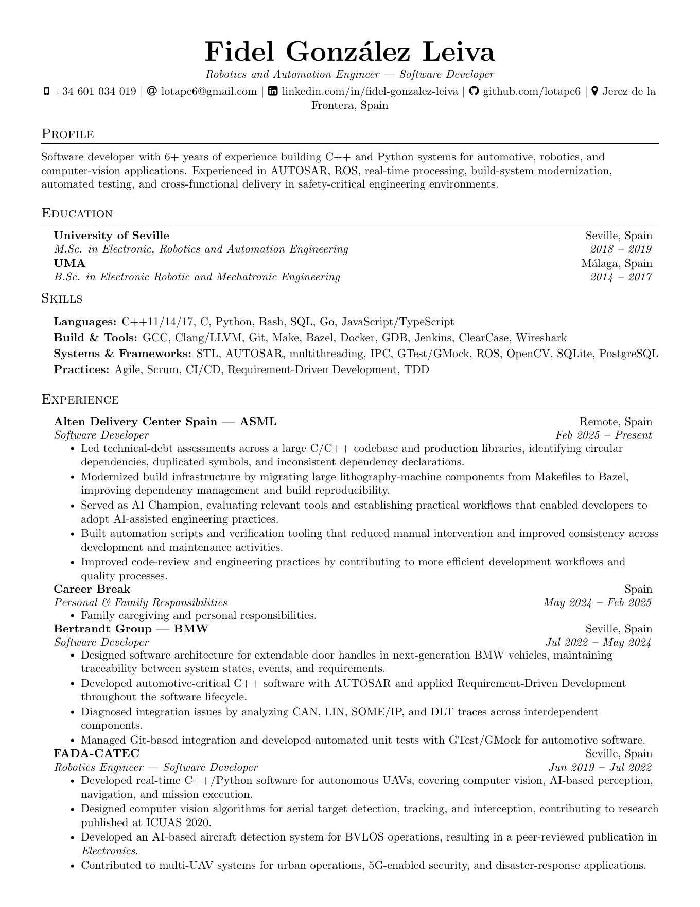

# Fidel Gonzalez Leiva | Curriculum Vitae

Professional CV for Fidel Gonzalez Leiva, Robotics and Automation Engineer and Software Developer.

## Latest version

The rendered CV is generated automatically from [`main.tex`](main.tex) whenever it changes on the default branch.

- [Download the latest PDF](assets/cv.pdf)
- [View page 1](assets/cv-1.png)
- [View page 2](assets/cv-2.png)



The generated PDF and page previews are committed to [`assets/`](assets/) by [`.github/workflows/build-cv.yml`](.github/workflows/build-cv.yml), so this README always points to the latest published version.

## Local build

Install a LaTeX distribution with `pdflatex` and Poppler's `pdftoppm`, then run:

```sh
pdflatex -interaction=nonstopmode -halt-on-error main.tex
mkdir -p assets
cp main.pdf assets/cv.pdf
pdftoppm -png -r 160 main.pdf assets/cv
```

## Repository contents

- [`main.tex`](main.tex): source document.
- [`assets/`](assets/): generated PDF and PNG previews used by this README.
- [`deps/`](deps/): related notes and supporting material.
- [GitHub Actions workflow](.github/workflows/build-cv.yml): reproducible build and publication automation.

## Credits and license

The CV layout is based on the [Aras Gungore CV template](https://github.com/arasgungore/arasgungore-CV), released under the MIT License. The original attribution is retained in [`main.tex`](main.tex). See [`deps/cv-2026/LICENSE`](deps/cv-2026/LICENSE) for the included template license text.

The personal content in this repository belongs to Fidel Gonzalez Leiva. The template license and attribution remain applicable to the portions derived from the original project.
